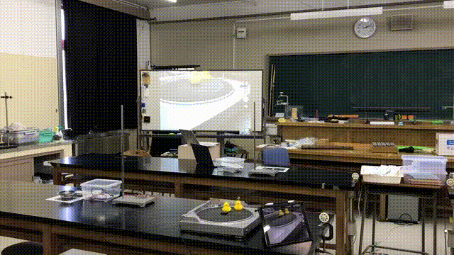
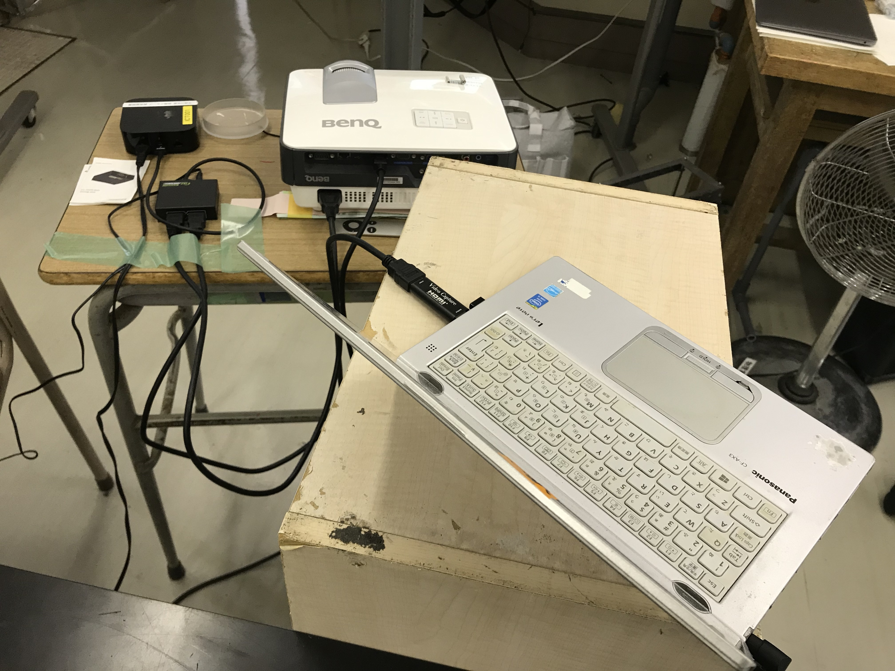
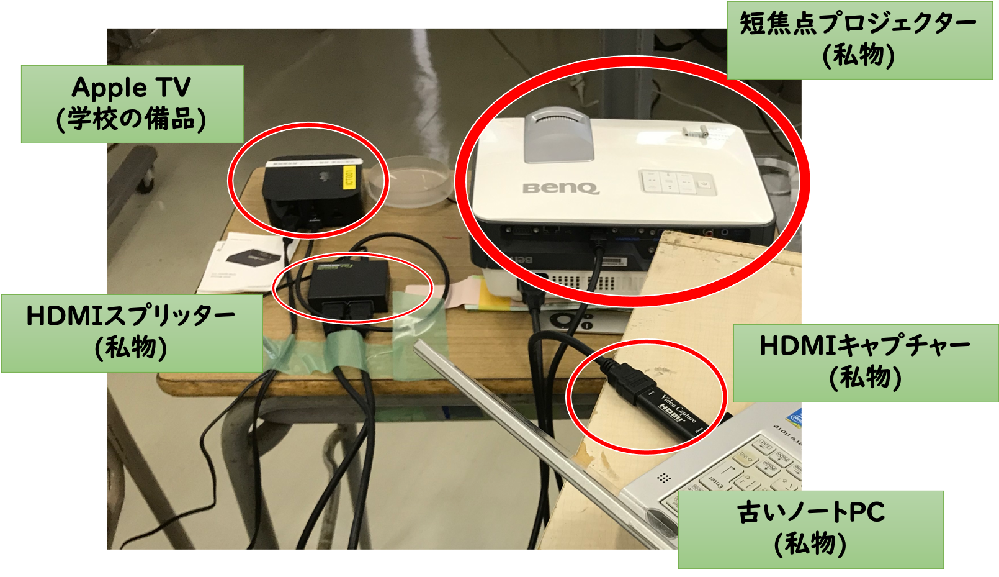
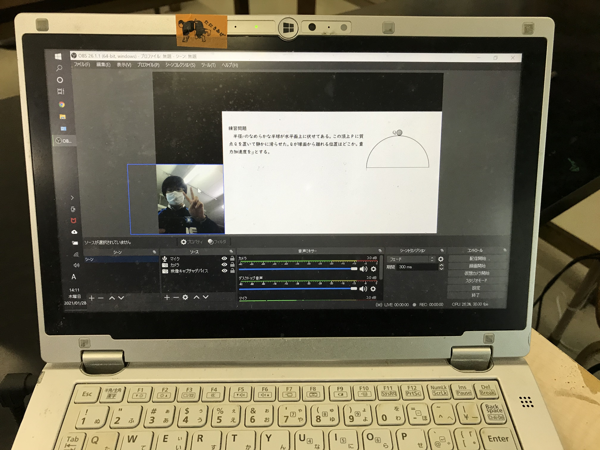

# 授業録画の方法
2021年2月例会（Zoom）  
  
[資料はこちら](https://github.com/phys-ken/2020buturikiso_slides)

---

### 普段の授業のやり方

* AppleTVとiPadで、授業プリントをホワイトボードに表示
* 生徒に配った授業プリントと同じものをうつしながら、書き込んでいく。  

---

### 普段の授業のやり方(続き)

* 書画カメラ風の使い方もできる。  

---

### 授業を録画したい！  
* 欠席生徒の対応
* 休校になるかも？
* 授業研究
* 授業動画作成の簡略化にもつながる。

---

### 録画環境
   　

---

### 録画環境(解説)
   　

---

* 注意　
  * 私物端末の持ち込みについては、ルールに従うこと

---

### 録画中の画面

---

### 録画できたもの

---

### 使ったもの

* [HDMI スプリッター](https://www.amazon.co.jp/KanaaN-HDMI%E3%82%B9%E3%83%97%E3%83%AA%E3%83%83%E3%82%BF%E3%83%BC-1%E5%85%A5%E5%8A%9B2%E5%87%BA%E5%8A%9B-Y-%E3%82%A2%E3%83%80%E3%83%97%E3%82%BF-2-fach/dp/B00QVEHQWO/ref=asc_df_B00QVEHQWO/?tag=jpgo-22&linkCode=df0&hvadid=342558075005&hvpos=&hvnetw=g&hvrand=15994148968855371295&hvpone=&hvptwo=&hvqmt=&hvdev=c&hvdvcmdl=&hvlocint=&hvlocphy=1009344&hvtargid=pla-798138383184&psc=1)

  * 運よく、近くのハードオフで見つけて1500円くらいで買った。 

* [HDMIキャプチャー](https://www.amazon.co.jp/%E3%80%902020%EF%BC%86%E6%96%B0%E3%82%B0%E3%83%AC%E3%83%BC%E3%83%89%E3%83%81%E3%83%83%E3%83%97%E3%80%91-%E3%82%AD%E3%83%A3%E3%83%97%E3%83%81%E3%83%A3%E3%83%BC%E3%83%9C%E3%83%BC%E3%83%89-%E3%82%B2%E3%83%BC%E3%83%A0%E3%82%AD%E3%83%A3%E3%83%97%E3%83%81%E3%83%A3%E3%83%BC-%E3%83%93%E3%83%87%E3%82%AA%E3%82%AD%E3%83%A3%E3%83%97%E3%83%81%E3%83%A3%E3%83%BC-%E3%82%B2%E3%83%BC%E3%83%A0%E5%AE%9F%E6%B3%81%E7%94%9F%E9%85%8D%E4%BF%A1%E3%80%81%E9%85%8D%E4%BF%A1%E3%80%81%E7%94%BB%E9%9D%A2%E5%85%B1%E6%9C%89%E3%80%81web%E4%BC%9A%E8%AD%B0%E3%81%AB%E9%81%A9%E7%94%A8/dp/B08BFX9D8W/ref=sr_1_16?__mk_ja_JP=%E3%82%AB%E3%82%BF%E3%82%AB%E3%83%8A&dchild=1&keywords=HDMI+%E3%82%AD%E3%83%A3%E3%83%97%E3%83%81%E3%83%A3%E3%83%BC&qid=1611820079&s=computers&sr=1-16)
  * 入れ替わりが多い、上のリンク切れるかも
  * Amazonで調べるとその時々で見つかる。
* [OBS(フリーソフト)](https://obsproject.com/ja)
  * PCのスペックが低くても耐えてくれそう。

---

### 使ったもの(続き)
* Apple TV
* iPad
* プロジェクター
* 誰も使ってなかったホワイトボード

---

### 感想
* ストレスなく、授業録画&配信ができた。
* 生徒の声が結構入る＆生配信だと編集ができない。
  * 生徒の雑談が配信に混じると、"放送事故"

---

### 参考にしたもの
* 千葉工業大学の上田先生の[授業動画](https://youtube.com/playlist?list=PLbUh9y6MXvjfOLwmuuBbXKUX45rZsM8iH)
  * Twitterで突撃したら、授業動画の撮り方を教えてくれた。
  * このスライドは、[reveal.js](https://revealjs.com/)を使って作成した。

* 参考　
  * [これからのプレゼン資料は reveal.js を使おう](https://qiita.com/Targityen/items/40ae4795e2cb77c1adc6)

---

### おまけ
* 上田先生の授業で扱っていた、"確率ロボティクス" という学問が、面白かった。
* 測定精度の限界があるから、ロボットは自分の現在位置を正確には把握できない。
* "信念"という不確定性のある量を元に、自分の位置を推測しながら運動をする。

